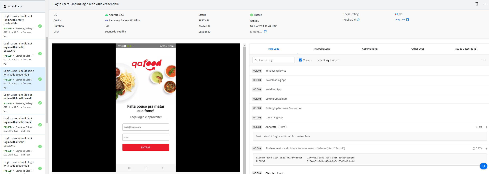
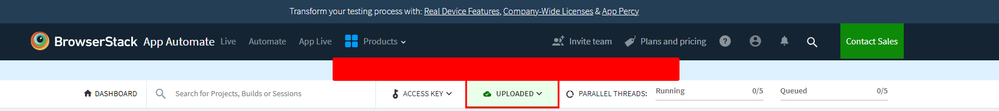
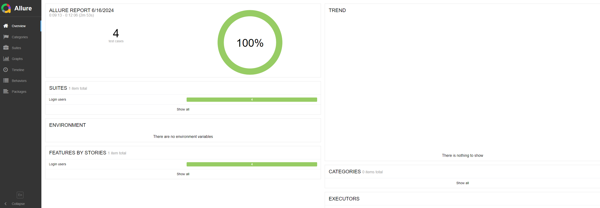

# Challenge - Automação Mobile

Automação de teste Mobile utilizando WebdriverIO

## Tecnologias Utilizadas

[](https://nodejs.org/en)
[](https://mochajs.org/)
[](https://appium.io/docs/en/latest/)
[](https://webdriver.io/)
[](https://www.npmjs.com/package/dotenv)
[](https://www.browserstack.com/)
[](https://allurereport.org/)
[](https://developer.mozilla.org/en-US/docs/Web/JavaScript)

## Descrição do Projeto

Este projeto foi desenvolvido com o objetivo de aprimorar os aprendizados em automação mobile utilizando WebdriverIO. A automação de testes visa garantir a qualidade e a funcionalidade do aplicativo, cobrindo cenários críticos e preparando a base para a expansão futura dos testes.

## Cenários Automatizados

Até o momento, os seguintes cenários foram automatizados:

1. **Login com Sucesso**: Verifica se um usuário pode realizar login com credenciais válidas.
2. **Campos de login vazio**: Verifcar mensagem de erro no caso do usuário não informar os dados de login.
3. **Dados inválidos**: Verificar mensagem de erro no caso do usuário informar dados inválidos para o login.


## Instalação

Instalar as dependências

```bash
  npm install
```

## Execução dos testes local

```bash
  npm run wdio
```

## Execução dos testes via Browserstack

![Imagem da execução via Browserstack]


```bash
  npm run bs
```

## Antes de executar os testes no Browserstack, não se esqueça de realizar o upload no site e configurar as informações no arquivo .env

![Upload do aplicativo]


## Verificar relatório das execuções

![Relatório Allure]


```bash
  npm run allure
```